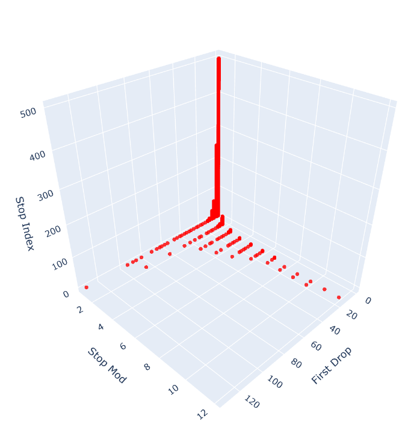
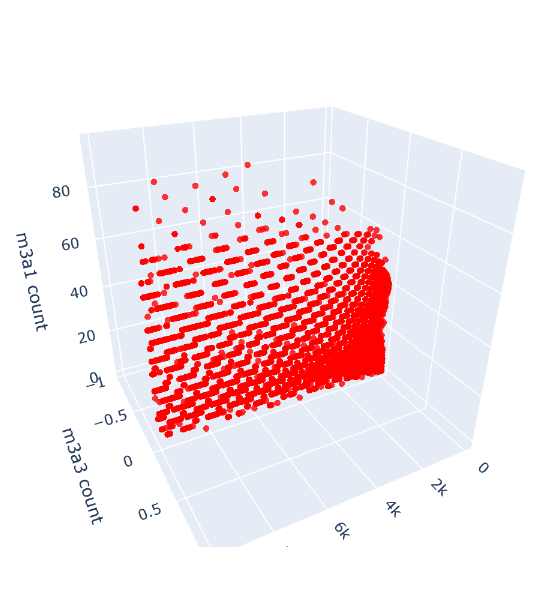
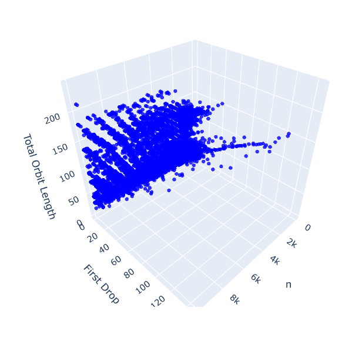
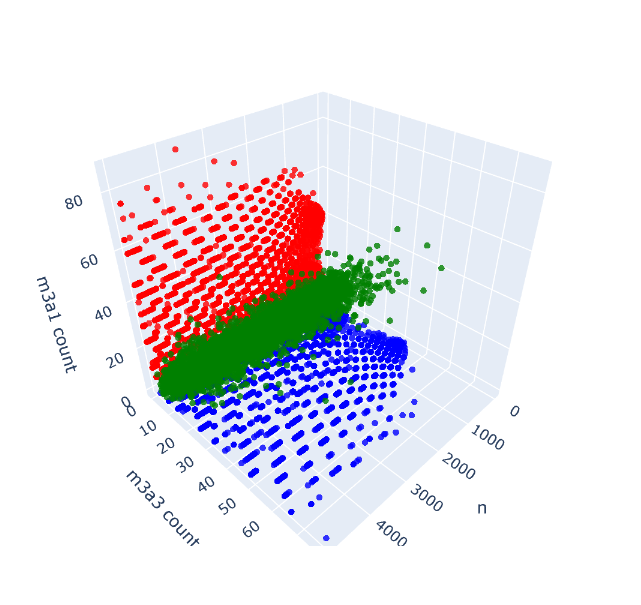

# **Collatz Conjecture Exploration**

This project is a computational and visual exploration of the Collatz Conjecture, focusing on its geometric and modular properties. The work leverages structured frameworks to analyze Collatz sequences, revealing patterns in stopping times, modular relationships, and periodic behaviors. This repository serves as both a toolkit and a foundation for further investigation into one of mathematics' most intriguing unsolved problems.



---

## **Overview**

The Collatz Conjecture, also known as the "3n + 1 problem," is a well-known mathematical puzzle. This project explores its behaviors through computational methods, emphasizing:

1. **Stopping Times**:

- **First Drop**: Steps required for a sequence to reach a value smaller than its starting integer.
- **Total Stopping Time**: Total steps required for a sequence to reach `1`.

2. **Modular Structures**:

- Grouping integers by First Drop and analyzing their modular properties.
- Studying relationships between modular groups and their spacings.

3. **3D Geometric Mapping**:

- Mapping integers into 3D space using attributes like First Drop, Stopping Modulus, and Stopping Index.
- Highlighting periodic and sparse distribution properties within Collatz sequences.

4. **Granular Operation Tracking**:

- **Operation IDs**: Assign unique identifiers to operations like multiplication (`m3a1`) and division (`d2`).
- **Detailed Statistics**: Track the number of times each operation is applied within a sequence.
- **Custom Analysis**: Use operation IDs to filter and analyze sequences based on specific criteria.

This feature enhances the ability to dissect and understand the intricate steps involved in Collatz sequences, offering a deeper level of exploration and insight.

---

## **Key Features**

- **Customizable Orbit Exploration**: Define orbit generation rules using `OrbitOptions` for tailored analyses.
- **3D Visualization**: Generate interactive 3D scatterplots to visualize geometric patterns.
- **Batch Processing**: Process large sets of integers efficiently using pre-defined or custom rules.
- **Modular Analysis**: Examine modular relationships and periodic behaviors in Collatz sequences.

---

### **Core Functions**

- **`generate_orbit_info`**:
  Processes a single orbit and computes detailed information, including First Drop, stopping modulus, and operation statistics.

- **`generate_points_from_option`**:
  Batch processes multiple orbits and prepares data for visualization, including 3D point generation and color assignment.

- **`draw_3d_scatterplot`**:
  Visualizes 3D points in an interactive scatterplot using Plotly, allowing for dynamic exploration of Collatz-related data.

- **`graph_options_evaluation`**:
  Combines multiple `OrbitOptions` configurations, applies custom color schemes, and generates a 3D scatterplot for comparative analysis.

### **Classes**

- **`OrbitOptions`**:
  Defines rules for orbit generation, including halting criteria, increase/decrease operations, and modular behaviors.

- **`OrbitInfo`**:
  Represents detailed information about a single Collatz orbit, including attributes like First Drop, stopping modulus, stopping index, and operation statistics. Used extensively for analysis and visualization.

---

## **Example Usage**

## **Classic 3x+1 Example**

This example demonstrates the classic "3x + 1" rule applied to the Collatz Conjecture. It defines an orbit configuration using `OrbitOptions`, generates points based on stopping properties, and visualizes the result in a 3D scatterplot.

```python
from utils.orbit_info import OrbitInfo
from utils.collatz_construction import OrbitOptions
import utils.graphing as graph

graph.POINT_SIZE = 3

options = OrbitOptions(
    name="m3a1",
    min_n=1,
    should_halt=lambda n: n == 1,
    should_decrease=lambda n: n % 2 == 0,
    should_increase=lambda n: n % 2 == 1,
    decrease=lambda n: (n // 2, "d2"),
    increase=lambda n: (3 * n + 1, "m3a1"),
    append_to_orbit=lambda n, orbit: orbit.append(n)
)

points, labels, colors = graph.generate_points_from_option(
    up_to_n=10000,
    options=[options],
    colors=["red"],
    point_builder=lambda info: (info.first_drop, info.stop_mod, info.stop_index)  # type: OrbitInfo
)

graph.draw_3d_scatterplot(points, labels, colors, x_axis="First Drop", y_axis="Stop Mod", z_axis="Stop Index", title="3n+1 (m3a1) Up to 10,000")
```



## **3x+3 Example**

This example demonstrates the "3x + 3" rule applied to the Collatz Conjecture. It defines an orbit configuration using `OrbitOptions`, generates points based on stopping properties, and visualizes the result in a 3D scatterplot.

```python
graph.POINT_SIZE = 3

options = OrbitOptions(
    name="m3a3",
    min_n=3,
    should_halt=lambda n: n == 3,
    should_decrease=lambda n: n % 2 == 0,
    should_increase=lambda n: n % 2 == 1,
    decrease=lambda n: (n // 2, "d2"),
    increase=lambda n: (3 * n + 3, "m3a3"),
    append_to_orbit=lambda n, orbit: orbit.append(n)
)

points, labels, colors = graph.generate_points_from_option(
    up_to_n=10000,
    options=[options],
    colors=["blue"],
    point_builder=lambda info: (info.n, info.first_drop, len(info.total_orbit or []) )  # type: OrbitInfo
)

graph.draw_3d_scatterplot(points, labels, colors, x_axis="n", y_axis="First Drop", z_axis="Total Orbit Length", title="3n+3 (m3a3) up to 10,000")
```



## **Example Streamlined Workflow**

This section demonstrates how to streamline the process of exploring Collatz orbits by leveraging modularity and reusable processing pipelines. The goal is to separate the orbit generation, transformation, and visualization phases, enabling scalability and flexibility for different rules and analyses.

```python
import utils.collatz_construction as cc

# Define a custom point builder to transform OrbitInfo into a 3D representation
def point_builder(info: OrbitInfo):
    return (info.n, info.get_total_op_count('m3a3'), info.get_total_op_count('m3a1'))

# Generate the 3x+1 configuration using a helper method
m3a1_option = cc.create_m3a1_options()

# Use a modular graphing function to process and visualize the data
graph.graph_options_evaluation(
    10000,
    [m3a1_option],
    point_builder,
    ['red'],
    'n',
    'm3a3 count',
    'm3a1 count',
    title='m3a1 Options Eval Up to 10,000'
)
```

## **Comparison of Multiple Options**

This example demonstrates how to compare multiple configurations (e.g., "3x+1," "3x+3," and a probabilistic rule) within a single visualization. The approach highlights how different rules behave under the same processing pipeline, leveraging color-coded data points for clarity.

```python
import utils.collatz_construction as cc
import utils.graphing as graphing
from utils.orbit_info import OrbitInfo

graphing.POINT_SIZE = 3

# Define a custom point builder to transform OrbitInfo into a 3D representation
def point_builder(info: OrbitInfo):
    return (info.n, info.get_total_op_count('m3a3'), info.get_total_op_count('m3a1'))

# Generate options for multiple rules
m3a1_option = cc.create_m3a1_options()
m3a3_option = cc.create_m3a3_options()
probability_option = cc.create_probabilistic_options(0.5)

# Evaluate and visualize the options
graphing.graph_options_evaluation(
    5000,
    [m3a1_option, m3a3_option, probability_option],
    point_builder,
    ['red', 'blue', 'green'],
    title='Comparing Multiple Options'
)
```


