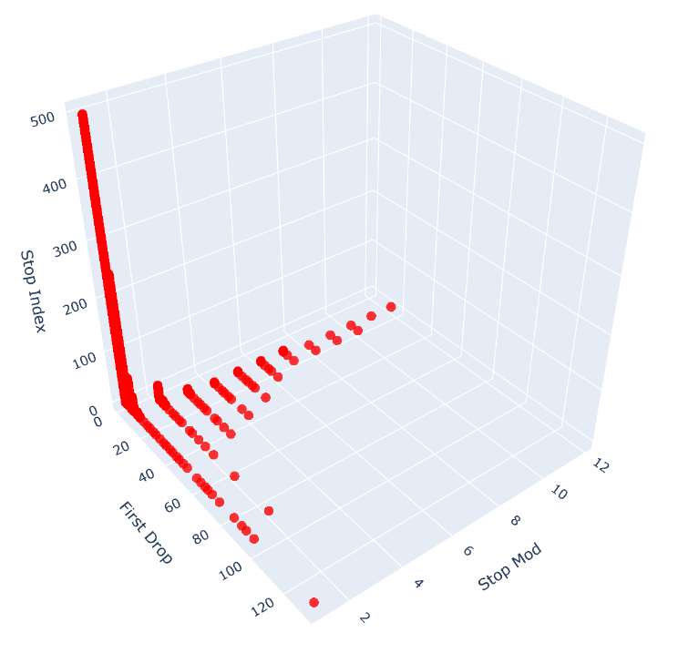

# **Collatz Conjecture Exploration**

This project explores several structured ideas around the Collatz Conjecture, focusing on its geometric and modular properties. The work is centered on mapping Collatz orbits into a well-defined space, revealing patterns in stopping times, modular relationships, and periodic behaviors. The goal is to provide a framework for analyzing Collatz sequences with the aid of computational tools and theoretical constructs.

---

## **Overview**

The Collatz Conjecture, also known as the "3n + 1 problem," is a famous unsolved problem in mathematics. This project aims to examine some of its intricate behaviors through:

1. **Stopping Times**:

   - **First Drop**: The number of steps required for a Collatz sequence to reach a value smaller than the starting integer.
   - **Total Stopping Time**: The total number of steps required for a Collatz sequence to reach `1`.

2. **Modular Structures**:

   - Investigating how integers with the same First Drop are distributed into modular groups.
   - Understanding the relationship between modular groups and their spacing.

3. **Mapping Collatz Orbits into 3D Space**:
   - Each integer is represented as a point in 3D space based on its First Drop, Stopping Modulus, and Stopping Index.
   - This approach highlights the periodic and geometric properties of Collatz sequences, such as their sparse distribution in the address space and predictable periodic distances between related orbits.

### Visualization of Mappings in 3D Space



---

## **Dependencies**

This project uses Python for data analysis and visualization. It is recommended to use a Conda environment for managing dependencies as proper package management is not yet in place.

### **Recommended Environment Setup**

1. Install [Anaconda](https://www.anaconda.com/) or [Miniconda](https://docs.conda.io/en/latest/miniconda.html).
2. Create a new environment:
   ```bash
   conda create --name collatz python=3.11.5
   ```
